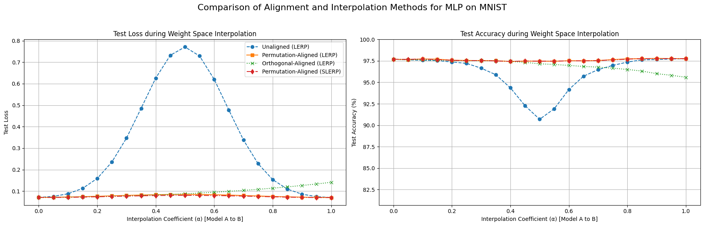
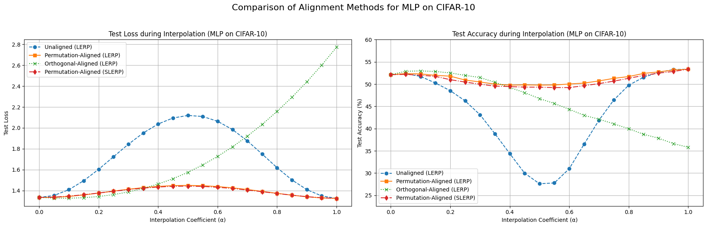

# Orthogonal Re-Basin: Beyond Permutations in Model Merging

This project explores the use of general orthogonal transformations as a means to align and merge independently trained neural networks. It extends the "Git Re-Basin" framework by relaxing its permutation-only constraint to the full orthogonal group.

[](https://colab.research.google.com/github/lollo-salis/Orthogonal_re-basin_model_merging/blob/main/notebooks/Orthogonal_re_basin.ipynb)

## Abstract

The [Git Re-Basin](https://arxiv.org/abs/2209.04836) framework has shown that models with the same architecture, trained independently, can often be aligned via permutation of their hidden units. This alignment reveals linear mode connectivity, allowing for effective model merging. However, this powerful technique is strictly limited to permutation matrices, which form only a small subgroup of the full orthogonal group.

This project investigates whether this concept can be generalized. We relax the permutation constraint and explore **general orthogonal transformations** (e.g., rotations), computed via Procrustes analysis, as a method to align models. We evaluate whether these transformations can align internal representations, even when they introduce minor incompatibilities with nonlinearities like ReLU.

## Key Findings

Our analysis reveals a fundamental difference between permutation-based and general orthogonal alignment in the presence of ReLU activations:

1.  **Residual Misalignment Error:** Orthogonal transformations do not commute with the ReLU nonlinearity (i.e., `ReLU(Qx) ≠ Q · ReLU(x)`). This non-commutativity introduces a **functional residual misalignment error**, meaning the orthogonally-aligned model B is no longer functionally equivalent to the original model B. This leads to a loss barrier and a drop in accuracy during interpolation, as shown in the experiments.

2.  **Interpolation Quality:** Permutation-based alignment (Git Re-Basin) successfully identifies a low-loss "basin" between the two models, enabling a smooth, high-accuracy path during both Linear (LERP) and Spherical Linear (SLERP) interpolation. In contrast, orthogonal alignment fails to find this basin due to the residual error, resulting in a significant performance drop, especially on more complex datasets like CIFAR-10.

3.  **Cycle-Consistency:** The permutation alignment method is shown to be cycle-consistent (`P_ab · P_ba = I`), a desirable property for geometric transformations. The Procrustes-based orthogonal alignment, however, is not perfectly cycle-consistent, though the numerical error is small.

### Experiment 1: MLP on MNIST



On MNIST, the performance degradation from orthogonal alignment is relatively mild compared to permutation alignment, suggesting the residual misalignment error is contained for this simpler task.

### Experiment 2: MLP on CIFAR-10



On the more complex CIFAR-10 dataset, the loss barrier for orthogonal alignment is far more pronounced. This highlights how the residual misalignment error becomes a significant obstacle as task complexity increases, preventing effective model merging.

## Repository Structure

-   **/src:** Contains the core Python modules with all major classes and functions.
    -   `models.py`: Definitions for the MLP architectures.
    -   `aligners.py`: Implementations of `PermutationAligner` (Git Re-Basin) and `OrthogonalAligner` (Procrustes).
    -   `utils.py`: Helper functions for training, evaluation, interpolation (LERP, SLERP), and analysis.
-   **/notebooks:** Contains the main Jupyter Notebook with the complete experiments.
-   **/images:** Contains the result plots generated by the notebook.
-   `requirements.txt`: A list of Python dependencies required to run the project.

## How to Run the Experiments

1.  **Clone the repository:**
    ```bash
    git clone https://github.com/lollo-salis/Orthogonal_re-basin_model_merging.git
    cd orthogonal-re-basin
    ```
2.  **Create a virtual environment (recommended):**
    ```bash
    python -m venv venv
    source venv/bin/activate  # On Windows: venv\Scripts\activate
    ```
3.  **Install the dependencies:**
    ```bash
    pip install -r requirements.txt
    ```
4.  **Run the notebook:**
    Open and run `notebooks/Orthogonal_re_basin.ipynb` using Jupyter Lab/Notebook. Alternatively, click the "Open in Colab" badge at the top of this README to run it directly in Google Colab.
